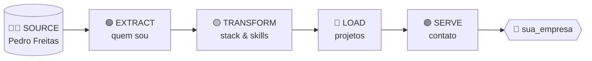

<div align="center">


# `pipeline: pedro_freitas`

**Futuro Engenheiro de Dados** · Ciência da Computação @ UNIFEOB · Formatura 2027

[](https://www.linkedin.com/in/pedro-freitas-b3b43a261)
[](mailto:pedrodefreitas13@hotmail.com)


</div>



---

## 🟢 STAGE 1 · `EXTRACT` — quem sou

```python
pedro = {
    "nome":       "Pedro Freitas",
    "formacao":   "Ciência da Computação — UNIFEOB (5º semestre, formatura 2027)",
    "foco":       "Engenharia de Dados",
    "objetivo":   "Estágio em Dados",
    "gosto_de":   ["pipelines", "ETL/ELT", "modelagem de dados", "dados limpos e confiáveis"],
    "mentalidade": "dado bruto não é problema, é matéria-prima",
}
```

> Gosto de pegar dados bagunçados, entender de onde vêm, limpar, modelar e entregá-los prontos para gerar decisão.

---

## 🟡 STAGE 2 · `TRANSFORM` — stack

| Camada | Ferramentas | Status |
|:--|:--|:--|
| **Linguagem** |  | ✅ `success` |
| **Consulta & Modelagem** |   | ✅ `success` |
| **Manipulação de dados** |  | 🔄 `running` |
| **Transformação (ELT)** |  | 🔄 `running` |
| **Containers** |  | 🔄 `running` |
| **Versionamento** |   | ✅ `success` |

<details>
<summary><b>📋 Ver log de execução</b></summary>

```log
[2026-10-01 08:00:01] INFO  task=python_fundamentals      status=SUCCESS  (scripts, automações, bots)
[2026-10-01 08:00:02] INFO  task=sql_modeling             status=SUCCESS  (modelagem, joins, consultas otimizadas)
[2026-10-01 08:00:03] INFO  task=pandas_dataframes        status=RUNNING  (limpeza e transformação de dados)
[2026-10-01 08:00:04] INFO  task=dbt_models               status=RUNNING  (modelos, testes e documentação)
[2026-10-01 08:00:05] INFO  task=docker_containers        status=RUNNING  (ambientes reproduzíveis)
[2026-10-01 08:00:06] WARN  task=first_data_internship    status=PENDING  aguardando oportunidade... 👀
```

</details>

---

## 🔵 STAGE 3 · `LOAD` — projetos

| Projeto | Descrição | Stack |
|:--|:--|:--|
| 🧾 [**Sistema-de-Gestao**](https://github.com/PedroFreitasDev/Sistema-de-Gestao) | Sistema de gestão de usuários e produtos via terminal, com CRUD e organização dos dados. | `Python` |
| 🌐 [**PI-DesenvolvimentoWEB-Unifeob-2025**](https://github.com/PedroFreitasDev/PI-DesenvolvimentoWEB-Unifeob-2025) | Projeto integrador em equipe resolvendo um problema real, com integração front-end ↔ back-end. | `HTML` `Bootstrap` `JS` |

### 🗺️ Próximos deploys (roadmap)

- [ ] 🛠️ **Pipeline ETL end-to-end** — extrair dados de uma API pública, tratar com Pandas e carregar em banco SQL
- [ ] 🧱 **Projeto dbt** — camadas `staging → intermediate → marts` com testes de qualidade de dados
- [ ] 🐳 **Ambiente de dados com Docker** — banco + pipeline rodando com um único `docker compose up`
- [ ] 📊 **Modelagem dimensional** — esquema estrela (fato + dimensões) a partir de dados reais

---

## 📈 Métricas do pipeline

<div align="center">
  
  
  <br/>
  
</div>

---

## 🟣 STAGE 4 · `SERVE` — vamos conversar?

```sql
SELECT contato, link
FROM   pedro_freitas.canais
WHERE  interesse = 'vaga_de_estagio_em_dados';
```

| contato | link |
|:--|:--|
| 💼 LinkedIn | [linkedin.com/in/pedro-freitas-b3b43a261](https://www.linkedin.com/in/pedro-freitas-b3b43a261) |
| 📧 E-mail | [pedrodefreitas13@hotmail.com](mailto:pedrodefreitas13@hotmail.com) |

<div align="center">

```
✔ Pipeline finalizado com sucesso · 0 erros · 1 dev pronto para aprender e entregar
```

<sub>Obrigado pela visita! Se chegou até aqui, a próxima task é sua: <code>send_message()</code> 🚀</sub>

</div>
